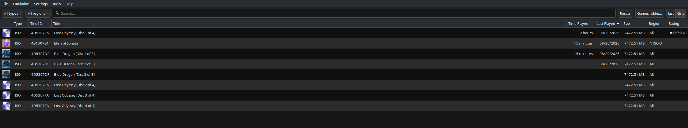
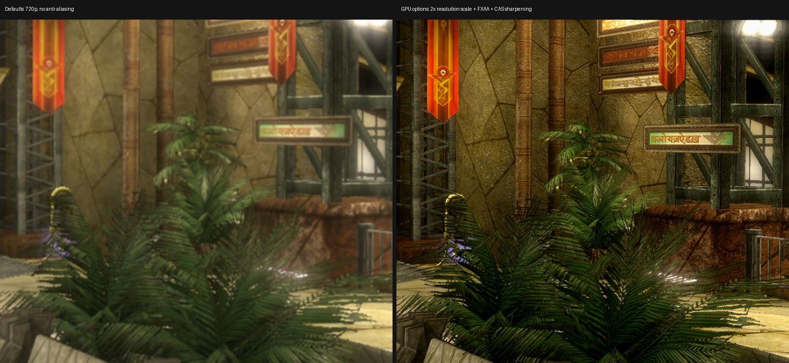
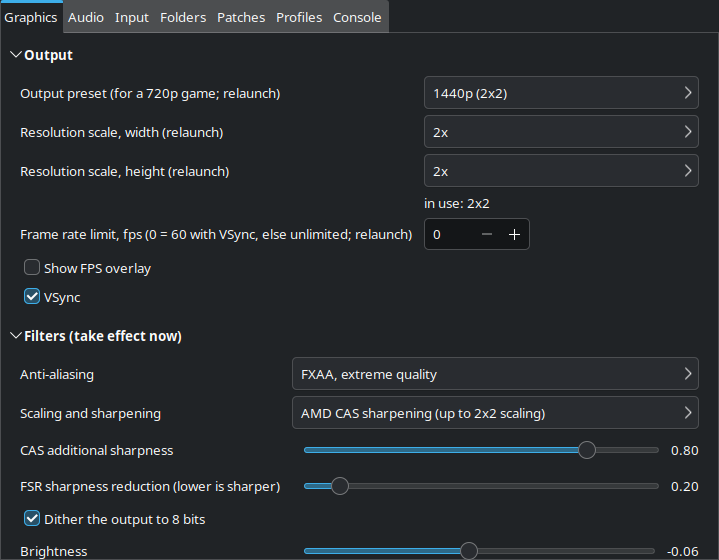

<p align="center">
    <a href="https://github.com/xenia-canary/xenia-canary/tree/canary_experimental/assets/icon">
        
    </a>
</p>

<h1 align="center">Xenia Canary (PeerLoom)</h1>
<p align="center">Xbox 360 emulator &mdash; save states, quality-of-life features, fixes</p>

This is [PeerLoom LLC](https://peerloomllc.com)'s fork of the
[Xenia Canary](https://github.com/xenia-canary/xenia-canary) Xbox 360
emulator. It adds save states and a set of quality-of-life features and
fixes, currently developed and tested on the **native Linux build**
(Vulkan, SDL audio, GTK UI); bringing the same features to the Windows
build is planned. It is not affiliated with the Xenia project.

Problems with this fork (save states, the added features, Linux issues)
belong in [this repository's issues](https://github.com/peerloomllc/xenia-canary/issues).
General questions about Xenia are covered by the upstream
[wiki](https://github.com/xenia-canary/xenia-canary/wiki) and
[FAQ](https://github.com/xenia-canary/xenia-canary/wiki/FAQ).

<p align="center">
    
</p>

## Highlights

* **Save states**: nine slots per title (per disc for multi-disc games),
  F8 saves, F10 loads, PageUp/PageDown picks the slot, with thumbnails
  and an in-game slot table. Guest memory, threads, kernel objects, the
  guest clock, GPU state and EDRAM, XMA audio decoder state, mounted DLC
  and the signed-in profile are all in the file. Single-player only.
* **Pause, fast-forward, slow-motion**: Space pauses (the game's clock
  stops with it), numpad + - * change speed with time-stretched audio
  (SoundTouch), Delete mutes, an FPS overlay; all keys reassignable
  in-app.
* **Preferences window**: graphics (output, colour filters, accuracy,
  performance), audio, input, folders (games, content, save states),
  per-game patches with lookup and download from the community patch
  repository, profiles, console settings.
* **Game library dashboard**: your scanned games folder with icons, list
  or grid view, playtime, and launch on double-click.
* **Advanced GPU options**: resolution scale up to 3x, anti-aliasing
  (FXAA), AMD CAS/FSR scaling and sharpening, colour filters
  (brightness, contrast, saturation, gamma), all from the Preferences
  window:

<p align="center">
    
</p>

* **Linux fixes**: guest threads that never started (games hanging at
  loading screens), kernel timers with past due times never firing
  (silent games), a syscall on every mutex lock, ImGui crashes with CJK
  fonts, and more. The generally useful ones are offered upstream as
  pull requests.

The [releases](https://github.com/peerloomllc/xenia-canary/releases) page
is the changelog.

<p align="center">
    
</p>

## Building

Each [release](https://github.com/peerloomllc/xenia-canary/releases)
carries an **AppImage** built on Ubuntu 24.04: download, `chmod +x`, run.
It needs glibc 2.39 or newer and a Vulkan driver, nothing else (the
runtime is static; no FUSE package required), and it updates in place
with [AppImageUpdate](https://appimage.github.io/AppImageUpdate/). A **tarball** built on
Fedora 44 against its system libraries is there too. To build from source on Fedora
(44):

```sh
sudo dnf install clang cmake ninja-build python3 gtk3-devel lz4-devel sdl2-compat-devel \
    vulkan-loader-devel spirv-tools glslang libunwind-devel alsa-lib-devel libX11-devel
git clone --recursive -b linux-native-work https://github.com/peerloomllc/xenia-canary.git
cd xenia-canary
export CC=/usr/bin/clang CXX=/usr/bin/clang++
./xb build --config=release
build/bin/Linux/Release/xenia_canary --gpu=vulkan --apu=sdl
```

Other distributions need the same libraries under their own names; see
[docs/building.md](docs/building.md) for the Ubuntu package list and the
`xb` script.

## Game compatibility

The upstream [game compatibility list](https://github.com/xenia-canary/game-compatibility/issues)
is the per-game status tracker. Reports there reflect upstream builds;
behaviour specific to this fork (save states, the added features, Linux
issues) belongs in [our issues](https://github.com/peerloomllc/xenia-canary/issues).

## Upstream documentation

The upstream [Quickstart](https://github.com/xenia-canary/xenia-canary/wiki/Quickstart),
[FAQ](https://github.com/xenia-canary/xenia-canary/wiki/FAQ) and
[wiki](https://github.com/xenia-canary/xenia-canary/wiki) apply to this
fork too.

## Relationship to upstream

Based on xenia-canary `9d08d64b5`. General fixes from this fork are
offered upstream as pull requests
([#1187](https://github.com/xenia-canary/xenia-canary/pull/1187),
[#1193](https://github.com/xenia-canary/xenia-canary/pull/1193),
[#1194](https://github.com/xenia-canary/xenia-canary/pull/1194));
the branch is rebased onto upstream periodically.

## Licence

BSD 3-Clause, the same as Xenia ([LICENSE](LICENSE)). Third-party
components include [SoundTouch](https://codeberg.org/soundtouch/soundtouch)
(LGPL 2.1, `third_party/soundtouch` submodule) and Project Nayuki's
[QR Code generator](https://github.com/nayuki/QR-Code-generator)
(MIT, vendored in `third_party/qrcodegen`), alongside upstream's
third-party set.

## Support development

If you receive value from this project, please consider returning value:
**Help &gt; Support development...** in the emulator, or
[peerloomllc.com/about](https://peerloomllc.com/about/).

## Disclaimer

The goal of this project is to experiment, research, and educate on the topic
of emulation of modern devices and operating systems. **It is not for enabling
illegal activity**. All information is obtained via reverse engineering of
legally purchased devices and games and information made public on the
internet.
